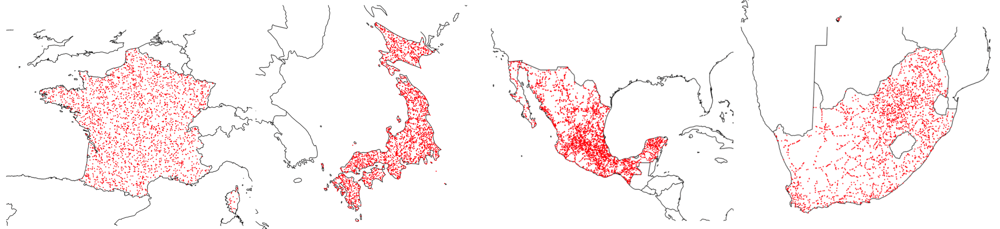
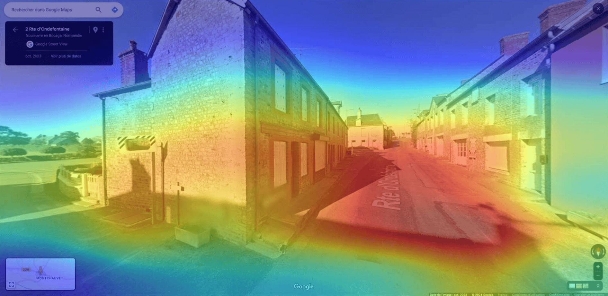

<!---------------------------------------------->
<a name="readme-top"></a>
<!---------------------------------------------->
<h1 align="center">
  <a></a>
</h1>

<h4 align="center">A Deep Learning Model for Country Classification Using Google Street View Images. 🗺️📍</h4>

<!---------------------------------------------->

## 🌄 Overview

`SpotThePlace` is a machine learning project focused on classifying the country of origin from random Google Street View images. By leveraging deep learning models, such as ResNet and Google Vision Transformer, we achieved an impressive **92% accuracy** in classifying images into one of four countries. The project also explores regression tasks for predicting geographical coordinates based on Street View images. 🌏🔍

Our dataset consists of **50,000 images** collected through **web scraping** with Selenium from Google Street View, ensuring a diverse and robust dataset for training.

### ✨ Key Features

- **Dataset**: 50,000 images collected via Selenium from Google Street View.
- **Models Tested**: ResNet50 and Google Vision Transformer with different levels of fine-tuning.
- **Key Results**: Achieved 92% accuracy in classifying images into four countries and ±250 km error in geographic regression.

<h1 align="center">
  <a></a>
  <a></a>
</h1>

<!---------------------------------------------->

## 🛠️ How To Use

### 📥 Dataset Collection

We collected **50,000 random images** across four countries using Selenium and Google Street View. To recreate the dataset, you can use our web scraping scripts in `scraping.ipynb`.

```python
from spottheplace import RandomPointGenerator
from spottheplace import StreetViewScraper

# Generate random points in a country
generator = RandomPointGenerator()
country_points = generator.generate_points_in_country(country_name="France", num_points=1000)

# Scrape Street View images from the generated points
scraper = StreetViewScraper(headless=True)
country_points = scraper.get_streetview_from_dataframe(country_points)
```

### 🚀 Training the Model

We trained our deep learning models using PyTorch and the Hugging Face Transformers library. You can train the models using the scripts in the `trainings` directory.

However, you can also use the pre-trained models hosted on [Hugging Face](https://huggingface.co/titouanlegourrierec/SpotThePlace)'s model hub with the code given in `model_usage.ipynb`.

### 🧠 Explainaibility and Interpretability

For the ResNet model, we implemented a Grad-CAM visualization to understand the model's decision-making process. You can try this out using the code in `model_usage.ipynb`:

```python
from huggingface_hub import hf_hub_download
from spottheplace.ml import GradCam

MODEL_PATH = hf_hub_download(
    repo_id="titouanlegourrierec/SpotThePlace",
    filename="Classification_ResNet50_4countries.pth"
    )
IMAGE_PATH = "path/to/your/image.jpg"
  
grad_cam = GradCam(MODEL_PATH)
grad_cam.explain(IMAGE_PATH)
```

<h1 align="center">
  <a></a>
</h1>

<!---------------------------------------------->

## 📊 Results

* **Best Model**: ResNet50 pretrained on ImageNet
* **Classification Accuracy**: 92% (4 countries)
* **Geographic Regression Error**: ±250 kilometers

<!---------------------------------------------->
<p align="right"><a href="#readme-top">back to top</a></p>
<!---------------------------------------------->

---

> GitHub [@titouanlegourrierec](https://github.com/titouanlegourrierec) &nbsp;&middot;&nbsp;
> Email [titouanlegourrierec@icloud.com](mailto:titouanlegourrierec@icloud.com)
